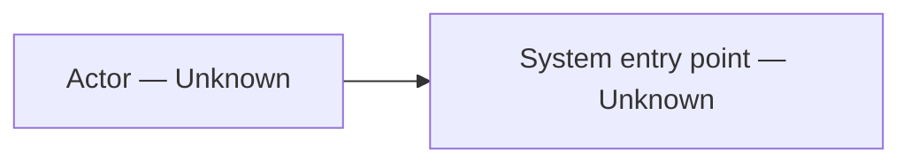

# Case Analysis

## Scope

## Case Summary

### Stated Problem and Users

### Workflow, Inputs, and Outputs

### Reported Capabilities, Scale, and Outcomes

### Source Limitations

## Architecture Reconstruction

### Architecture Claims

| ID | Component or flow | Status | Evidence | Confidence | Alternatives or unknowns |
| --- | --- | --- | --- | --- | --- |

## Technical Component Decomposition

| Layer/component | Responsibility | Inputs/outputs | Status/evidence | Dependencies | NFRs | Alternatives | Open questions |
| --- | --- | --- | --- | --- | --- | --- | --- |

## Data and Control Flow

## Security, Privacy, and Governance

## Operations, Evaluation, and Observability

## OCI Realization Options

| Required capability | OCI managed option | OCI-hosted/custom option | Hybrid/external option | Official source | Constraints/unknowns |
| --- | --- | --- | --- | --- | --- |

## Hypothesis Register

| ID | Material unknown/hypothesis | Why it matters | Testable? | Planned experiment or rationale | Status |
| --- | --- | --- | --- | --- | --- |

## Technical Comparison Points

| Dimension | Source implementation evidence | OCI option evidence | Conditions | Basis | Unknowns |
| --- | --- | --- | --- | --- | --- |

## Risks, Limitations, and Open Questions
