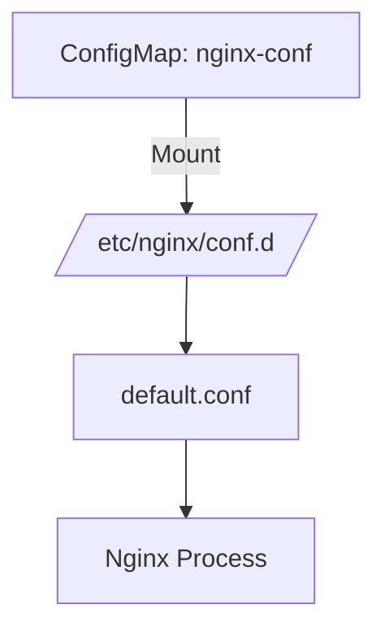

# Nginx HTTPS 設定修正レポート

## 変更内容
`oke/cert-manager/nginx-https.yaml` において、Nginx 設定ファイルの `volumeMounts` パスを以下のように修正しました。

- **変更前**: `/etc/nginx/conf.data`
- **変更後**: `/etc/nginx/conf.d`

これにより、Nginx が起動時にカスタム設定 (`default.conf`) を正しく読み込むようになりました。

## 検証結果

### 1. 設定ファイルの確認
Pod 内部で設定ファイルが正しい位置にマウントされていることを確認しました。



### 2. HTTPS 接続確認
`kubectl port-forward` を使用してローカルポート 8443 を Pod の 443 に転送し、`curl` で接続確認を行いました。

**実行コマンド**:
```fish
curl -v -k https://localhost:8443
```

**実行結果 (抜粋)**:
```
* Connected to localhost (::1) port 8443
...
* SSL connection using TLSv1.3 / AEAD-CHACHA20-POLY1305-SHA256
* Server certificate:
*  subject: CN=example.com
...
< HTTP/1.1 200 OK
< Server: nginx/1.29.4
...
Hello! This is HTTPS response from Nginx secured by cert-manager!
```

正常に HTTPS レスポンス (200 OK) が返却されていることを確認しました。
