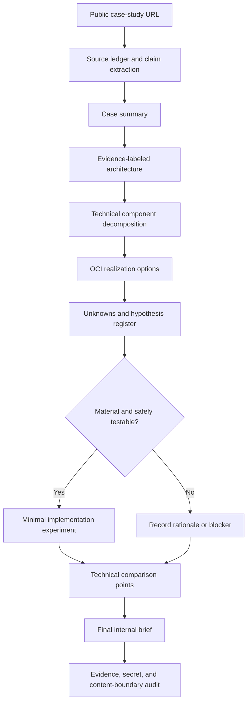

# AI Case-Study Validation Workflow

This workflow turns a public enterprise AI or GenAI case-study URL into an evidence-backed technical brief. It combines source research, architecture reconstruction, technical decomposition, OCI realization options, and focused implementation experiments for material unknowns.

The reusable Codex skill is located at `.agents/skills/validate-ai-case-study/`.

## Workflow



## Evidence Model

Every material architecture claim uses one of four labels:

| Label | Meaning |
| --- | --- |
| `Confirmed` | Directly supported by a cited primary source |
| `Inferred` | Reasoned from cited evidence but not directly stated |
| `Validated` | Observed in a documented implementation experiment |
| `Unknown` | Available evidence cannot establish the claim |

Inferences also include confidence, rationale, alternatives, and the evidence required to falsify them. An analogous experiment can validate behavior, but it does not prove a third party's undisclosed implementation.

## Output Boundary

| Output | Location | Git status |
| --- | --- | --- |
| Source ledger, case summary, inferred architecture | `internal-briefs/case-studies/<run>/` | Ignored |
| OCI realization options and technical comparisons | `internal-briefs/case-studies/<run>/` | Ignored |
| Case-specific prototypes and raw results | `internal-briefs/case-studies/<run>/artifacts/` | Ignored |
| Final technical brief | `internal-briefs/case-studies/<run>/90-final-brief.internal.md` | Ignored |
| Neutral and reusable implementation sample | Appropriate public technical directory | Tracked only after review gate |

Before analysis begins, the workflow verifies the internal run path with `git check-ignore`. It never uses `git add -f` for internal outputs.

## Implementation Decision

Implementation is selected when an unknown is material to the conclusion, cannot be resolved from reliable documentation, is safely testable, and can change the technical assessment. Each selected experiment defines acceptance and failure criteria before code is written.

Experiments prefer local, mocked, emulated, or free environments. Creating billable cloud resources, modifying external systems, using new credentials, publishing content, or performing destructive operations requires user approval.

## OCI Hands-On Validation

When an experiment requires OCI:

- Use OCI CLI to confirm authenticated connectivity, inspect the target environment, and verify the deployed result.
- Use Terraform for every OCI infrastructure create, update, and delete operation.
- Do not provision validation infrastructure through OCI Console clicks, OCI CLI mutation commands, SDK provisioning code, or ad hoc shell scripts.
- Put a single-product validation under the existing product directory as `<product>/<validation-topic>/`.
- Put a combined-service validation in a separate `integrations/<products-and-validation-topic>/` directory.
- Store Terraform configuration under the validation directory's `terraform/` subdirectory.
- Keep real `.tfvars`, state, plans, credentials, and raw sensitive output out of Git.

Example layouts:

```text
oke/native-ingress-controller/
├── README.md
├── terraform/
└── tests/

integrations/generative-ai-opensearch-rag/
├── README.md
├── app/
├── terraform/
└── tests/
```

The implementation log records OCI CLI preflight, Terraform format/init/validate/plan, apply approval, read-only OCI CLI verification, and Terraform cleanup or resource handoff.

## Run with Goal Mode

Replace `<URL>` and paste this into Codex:

```text
/goal Use $validate-ai-case-study to analyze <URL>. Execute the complete evidence-based workflow autonomously and satisfy the skill's Definition of Done. Store case analysis, inferred architecture, OCI mapping, comparisons, and the final brief only in ignored internal directories. Implement the smallest useful experiments for material uncertainties and record acceptance criteria and results. For OCI validation, use OCI CLI for connection and verification, use Terraform for every infrastructure lifecycle operation, and place code under the correct product or integrations directory. Keep tracked implementation vendor-neutral and reproducible. Do not create billable cloud resources or modify external systems without my approval.
```

The Goal is complete only after the source ledger, case analysis, architecture, component decomposition, OCI options, hypothesis decisions, implementation evidence, technical comparison points, final brief, and content-boundary audit are complete. A missing authorization or unavailable external dependency remains a documented blocker rather than an assumed result.

If `/goal` is not available, enable the feature with `codex features enable goals` or set `features.goals = true` in Codex configuration.
